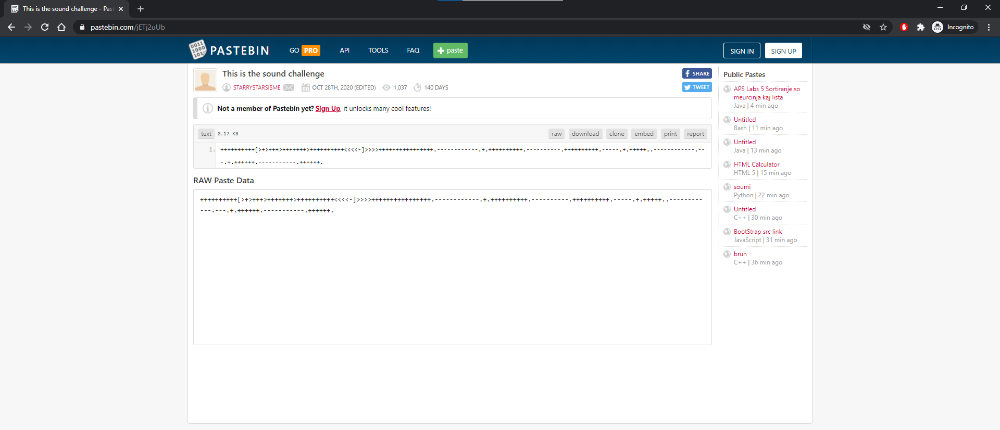

# [Stacks 2020 CTF] Voices in the Head - Forensic

## <u>Challenge Text</u>

 

 
<i>Voices in the Head - Challenge Text</i>

## <u>Introduction</u>

Voices in the head is a 2000 point forensic challenge. Along with the challenge text and an audio file named `forensic-challenge-2.wav` a hint was distributed to all teams as a starting point.

## <u>Solution</u>

The first thing we did was to open up the WAV file and check out the content. We were immediately rewarded with a loud deafening sound of what seems like birds chirping early in the morning... 😅

Now based off our limited CTF experience with the forensic challenges, usually, when an audio file is involved, it usually means steganography of some sort. We pulled out the trusty `Sonic Visualiser` tool and added a Spectrogram to the mix ... lo and behold, *** magic ✨***

 

 
<i>Enabling Spectrogram in Sonic Visualiser</i>

 

There you go, we actually found something. The text extracted from the audio reads `aHR0cDovL3d3dy5wYXN0ZWJpbi5jb20vakVUajJ1VWI=`. Notice the equal sign at the back of this string?  Based on past experiences in CTFs, this is a telltale sign which indicates that this string is `base64 encoded`. To decode this, we simply head over to <a href="www.base64decode.org ">www.base64decode</a> and decode our string.

 

 
<i>Online Base 64 Decoder</i>

 

A Paste Bin link? Alright, let us go check it out ...

 

 
<i>Secret Paste Bin Site</i>

 

Oh, what this? We have seen this before! Once again, with our limited CTF experience, we have come across challenges in the past that used this weird programming language / syntax. This language is known as `Brain Fuck` 🤔 

Now, if you never saw this before, you can easily copy and paste the symbols into our trusty friend, ***Google***, to find out what the symbols mean. That's how we came to learn about this weird programming language / syntax in the first place. 

So to decode this, we can use <a href="https://www.dcode.fr/brainfuck-language">https://www.dcode.fr/brainfuck-language</a> to decode the message:

 

 
<i>Decoding Brain Fuck</i>

 

What?! After decoding the message, we got the string `thisisnottheflag`. 🤬 did the challenge just pull one on us? At this point we were quite lost, seeing how all of what we did lead to nowhere...

But a light bulb 💡 moment came and we realised we had not touched the initial hint that was provided! `Xiao wants to help. Will you let him help you?`  Who is this Xiao, and why would he want to help us? ***Find out more on the next episode of Dragon Ball-Z*** ... (we ended up just Googling it)

Based on the hint, we came across a tool called <a href="https://xiao-steganography.en.softonic.com/">Xiao Steganography</a>, which seemed to fit what we were doing. Another steganography tool 🤔

 

 
<i>Xiao Steganography Tool</i>

 

Running it against our WAV file, it seems that a ZIP file was detected!! We attempted to open up the zip file ... and we got an error? 🤷‍♂️ What?

 

 
<i>Xiao Steganography Tool</i>

 

We tried throwing the ZIP file into <a href="https://www.x-ways.net/winhex/">WinHex</a> and discovered that the magic numbers were all messed up, is this a broken zip challenge?

 

 
<i>Win Hex on extracted ZIP</i>

 

We can see the magic numbers are all off. Not only that, it seems like the whole zip is messed up. Maybe its not a broken ZIP challenge after all ... now what? 🙃

Wait a minute ... could it be password protected? ***Its at this moment another light bulb appeared💡***

Remember when we decoded the base 64 string? Where we thought we got trolled, We the obtained string `thisisnottheflag`.

**It is not the flag, but it's the password for this tool !** 🤯🤯

 

 
<i>Xiao Steganography Tool</i>

 

With that, we now got have a valid ZIP file. Clicking on it now prompts us for another password. What the ... 🤬

 

 
<i>Proper Zip file but still asking for password !!!</i>

 

At this point, we thought that it might not actually be encrypted. Perhaps those classic broken ZIP file challenges. So we threw this new ZIP into <a href="https://www.x-ways.net/winhex/">WinHex</a> and ***WOAH*** we found the flag (or so we thought... trolled once again 😭😭😭)

 

 
<i>Win Hex - Proper Zip</i>

 

We submitted the "flag" `govtech-csg{Th1sisn0ty3tthefl@g}` to the challenge platform, guess what? Tt's fake ...

But wait ... "not yet the flag"? Could this actually be the password for the ZIP?

 

 
<i>The Real Flag !</i>

 

And there we go! We solved this challenge and got a clue to the next challenge 🌟

## <u>Conclusion</u>

Let us close this writeup with some key takeaways and learning points:

✅ Play lots of CTFs !! As seen throughout the writeup, we are generally correct when it comes to our guesses (steganography, base64, brainfuck, etc..). By playing lots of CTFs, you will gain new experiences which could prove to be useful for future CTFs. 

✅ Don't give up, throughout this challenge we faced many roadblocks ***BUT, we believed*** and we pulled through!

✅ Have fun! Honestly, we joked a lot about the fake flags, but hey, this challenge was actually pretty fun 😉

Special thanks to the members of team ***Ov3rWr1t3*** for pulling through. To those reading till this point, I hope you find this insightful and happy CTF-ing!

Signing off 
**~K0p1**
